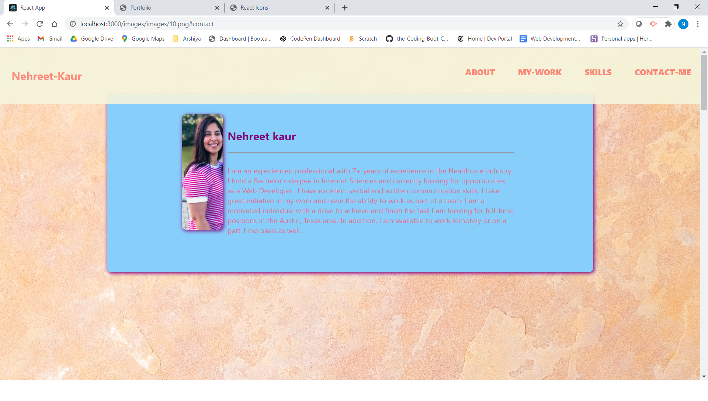
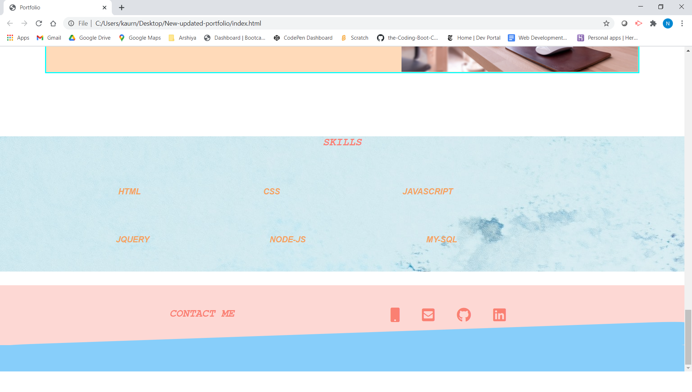

 # ABOUT 

**Portfolio** created with **REACT**.
User have to install react by running **npx-create-react-app<appname>** and then run **npm start** and then see the browser for output. User not need to stop the server when making changes.

 And I have used the **Flex-box** framework .

 # TABLE OF CONTENTS
 [OUTPUT](#Output)

 [WORK-AREA](#WORK-AREA)

 [RESOURCES-REFERRED](#RESOURCES-REFERRED)

 [TEXT-EDITOR](#TEXT-EDITOR)

 [PROGRAMMING-LANGUAGES](#PROGRMMING-LANGUAGE)

 [SCREEN-SHOTS](#SCREEN-SHOT)

 [GIT-HUB-REPOSITORY](#LINKS)
 
 [HEROKU--DEPLOYED-Application](#LINKS)

 

 # Output

 I have given **Hover-effects** and  also,tried **Slanted/Skewed** Div for my footer section.
 **ADDEDD** **SKILLS**  section 
 Can navigate within the page with the **LINKS** provided.

 # WORK-AREA

 Given breif **discription** about my **PROECT**
 and my ** Assignments** with the their **LINKS**
 to **GITHUB REPOITORY** and **GITHUB DEPLOYED Application**.
 Also, added my recent **PROJECT** and assignments.

 ## TEXT-EDITOR

 **VS-CODE**

 ## PROGRMMING-LANGUAGE 

   **REACT**

   **CSS**

   
   ## FRAMEWORK USED
   
   **FLEX-BOX**

    
   
   ## **RESOURCES-REFERRED**

   [FONT-AWESOME](https://fontawesome.com/icons?d=gallery)

   [FOR SKEWED DIV STYLE](https://www.w3schools.com/css/tryit.asp?filename=trycss3_transform_skew)

   [REACT-ICONS](https://react-icons.github.io/react-icons/)

   ## SCREEN-SHOT
   
   
   

    
  ## LINKS
  [Git-hub Repository](https://github.com/nehreetkaur/portfolio-react)

  [HEROKU-DEPLOYED-APPLICATION]()
   

